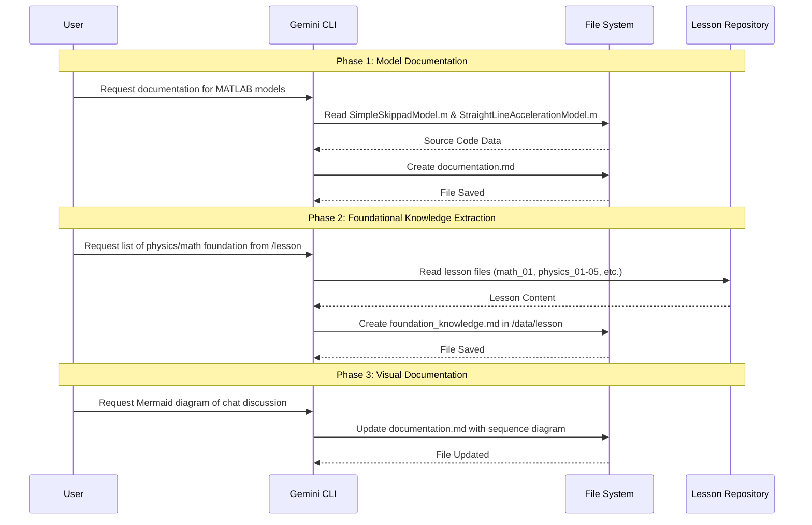

gemini --resume 1ec88865-c24f-496a-8b6e-a4505419dd82

1. https://drive.mathworks.com/files/FSAE_2026
2. https://matlab.mathworks.com/

# FSAE Simulator Dashboard - MATLAB Models Documentation

This document provides an overview of the MATLAB models used for simulating vehicle performance in various FSAE events.

## 1. Simple Skidpad Model (`SimpleSkippadModel.m`)

The `SimpleSkippadModel.m` script simulates a vehicle performing a skidpad maneuver, which consists of two full circles. It calculates the maximum achievable cornering speed and the resulting completion time.

### Key Features
- **Aerodynamic Effects:** Accounts for downforce ($C_l$) and drag ($C_d$) which scale with the square of the velocity.
- **Load-Sensitive Tire Model:** Tire friction coefficient ($\mu$) decreases as the vertical load on the tire increases.
- **Lateral Load Transfer:** Calculates the transfer of weight from inside to outside tires during cornering based on CG height, track width, and roll center height.
- **Iteration Method:** Tests a range of velocities to find the maximum speed where the required lateral force equals the available tire force.

### Key Parameters
- **Mass ($m$):** 300 kg
- **Radius ($r$):** 9 m
- **Nominal Friction ($\mu_0$):** 1.80
- **Aero Coefficients:** $C_l = 2.8$, $C_d = 1.3$
- **Chassis Geometry:** Track = 1.20 m, CG Height = 0.280 m, Roll Center Height = 0.05 m

### Outputs
- **Max Corner Speed:** Maximum speed (m/s and km/h) the car can sustain in the circle.
- **Lateral Acceleration:** Maximum lateral acceleration in g's.
- **Skidpad Time:** Total time to complete two full circles.
- **Peak Load Transfer:** Maximum lateral load transfer (N).

---

## 2. Straight-Line Acceleration Model (`StraightLineAccelerationModel.m`)

The `StraightLineAccelerationModel.m` script simulates the vehicle's performance in a 75-meter straight-line acceleration event.

### Key Features (Phase 3 Upgrade)
- **EMRAX Thermal Model:** Simulates heat buildup in the motor windings.
- **Thermal Derating:** Available torque is reduced as the motor heats up, reflecting real-world endurance limits.
- **Transient Chassis Dynamics:** Includes a second-order pitch model with damping and inertia.
- **Pacejka Tire Model:** Uses the Magic Formula to calculate longitudinal tire force based on slip ratio and transient vertical load.

### Difference from Legacy Approach
| Feature | Legacy Approach | Phase 3 (New) Approach |
| :--- | :--- | :--- |
| **Powertrain** | Static Torque-RPM Map | Dynamic Map with Thermal Derating |
| **Chassis** | Instantaneous Weight Transfer | Transient Pitch with Settling Time |
| **Aero** | Constant Coefficients | Attitude-Sensitive (Pitch/Ride Height) |
| **Tires** | Constant $\mu$ scaling | Load-Sensitive Pacejka coefficients |

### Key Parameters
- **Wheelbase ($L$):** 1.530 m
- **Pitch Stiffness ($K_{pitch}$):** 50,000 Nm/rad
- **Thermal Mass ($C_{thermal}$):** 2,500 J/K
- **Pacejka Constants:** $B, C, D, E$ are now functions of $F_z$.

### Outputs
- **75m Time:** Total time (s) to cover the distance.
- **Peak Temp:** Maximum motor temperature reached during the run.
- **Peak Pitch:** Maximum chassis dive/squat (degrees) during acceleration.

---

## 3. Documentation and Research Workflow

The following sequence diagram illustrates the process of documenting the MATLAB models and extracting foundational knowledge as discussed in the chat.

Section 3: Documentation and Research Workflow: Added a new section containing a Mermaid sequenceDiagram.
   - Diagram Content: It visualizes the three phases of our interaction:
       1. Phase 1: Documenting the MATLAB models.
       2. Phase 2: Extracting foundational physics and math knowledge from the
          lesson repository.
       3. Phase 3: Creating the visual documentation (the diagram itself).

You can view the diagram by opening documentation.md in any Markdown viewer that supports Mermaid.
Summary of Foundational Knowledge
  The extracted knowledge is categorized into three main pillars:

   1. Mathematics:
       * Unit Consistency: Strict adherence to SI units (N, kg, m/s, m/s²).
       * Trigonometry: Resolving gravitational components on road grades using
         sin(β) and cos(β).
       * Calculus: Using differential equations ($dv/dt$) to model acceleration
         and state-space for reduced-order models.
       * Statistics: Evaluating model performance using metrics like RMSE and
         MAPE.

   2. Physics:
       * Mechanics: Governing equations based on Newton's Second Law (∑ F = m ·
         a).
       * Force Balance: Analyzing Traction, Braking, Aerodynamic Drag (∝ v²),
         Rolling Resistance, and Grade Force.
       * Tire Interaction: Understanding Slip Ratio, the Pacejka Magic Formula,
         and longitudinal/lateral load transfer.
       * Powertrain: Torque-to-force conversion and dynamic behavior (delay and
         inertia).

   3. Systems Engineering:
       * Fidelity vs. Cost: Balancing physical accuracy with real-time
         computational requirements.
       * Uncertainty: Managing measurement noise, changing friction, and
         parameter variations.
