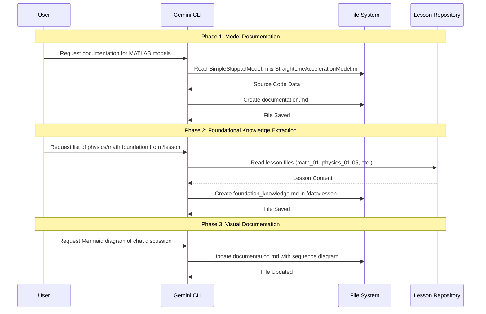

# FSAE Simulator Dashboard - MATLAB Models Documentation

This document provides an overview of the MATLAB models used for simulating vehicle performance in various FSAE events.

## 1. Simple Skidpad Model (`SimpleSkippadModel.m`)

The `SimpleSkippadModel.m` script simulates a vehicle performing a skidpad maneuver, which consists of two full circles. It calculates the maximum achievable cornering speed and the resulting completion time.

### Key Features
- **Aerodynamic Effects:** Accounts for downforce ($C_l$) and drag ($C_d$) which scale with the square of the velocity.
- **Load-Sensitive Tire Model:** Tire friction coefficient ($\mu$) decreases as the vertical load on the tire increases.
- **Lateral Load Transfer:** Calculates the transfer of weight from inside to outside tires during cornering based on CG height, track width, and roll center height.
- **Iteration Method:** Tests a range of velocities to find the maximum speed where the required lateral force equals the available tire force.

### Key Parameters
- **Mass ($m$):** 300 kg
- **Radius ($r$):** 9 m
- **Nominal Friction ($\mu_0$):** 1.80
- **Aero Coefficients:** $C_l = 2.8$, $C_d = 1.3$
- **Chassis Geometry:** Track = 1.20 m, CG Height = 0.280 m, Roll Center Height = 0.05 m

### Outputs
- **Max Corner Speed:** Maximum speed (m/s and km/h) the car can sustain in the circle.
- **Lateral Acceleration:** Maximum lateral acceleration in g's.
- **Skidpad Time:** Total time to complete two full circles.
- **Peak Load Transfer:** Maximum lateral load transfer (N).

---

## 2. Straight-Line Acceleration Model (`StraightLineAccelerationModel.m`)

The `StraightLineAccelerationModel.m` script simulates the vehicle's performance in a 75-meter straight-line acceleration event.

### Key Features
- **Pacejka Tire Model:** Uses the Magic Formula (stiffness, shape, and curvature factors) to calculate longitudinal tire force based on slip ratio.
- **Wheel Rotational Dynamics:** Simulates the angular acceleration of the wheel, accounting for motor torque and tire reaction force.
- **Motor Performance:** Uses an EMRAX motor torque-RPM map to determine available torque at different speeds.
- **Weight Transfer:** Models longitudinal weight transfer from front to rear axle during acceleration.
- **Drivetrain:** Includes gear ratio and efficiency factors.

### Key Parameters
- **Wheelbase ($L$):** 1.530 m
- **Wheel Radius ($r_{wheel}$):** 0.229 m
- **Motor:** EMRAX with specific torque map (230 Nm peak).
- **Gear Ratio ($GR$):** 3.5
- **Tire Inertia ($J_{wheel}$):** 0.60 kg·m²
- **Pacejka Constants:** $B=10, C=1.9, E=0.97$

### Outputs
- **75m Time:** Total time (s) to cover the 75-meter distance.
- **Top Speed:** Maximum velocity reached (km/h).
- **Peak Acceleration:** Maximum longitudinal acceleration (g).
- **Peak Slip Ratio:** Maximum tire slip recorded during the run.
- **Peak Tire Force:** Maximum longitudinal force generated by the tires.

---

## 3. Documentation and Research Workflow

The following sequence diagram illustrates the process of documenting the MATLAB models and extracting foundational knowledge as discussed in the chat.

