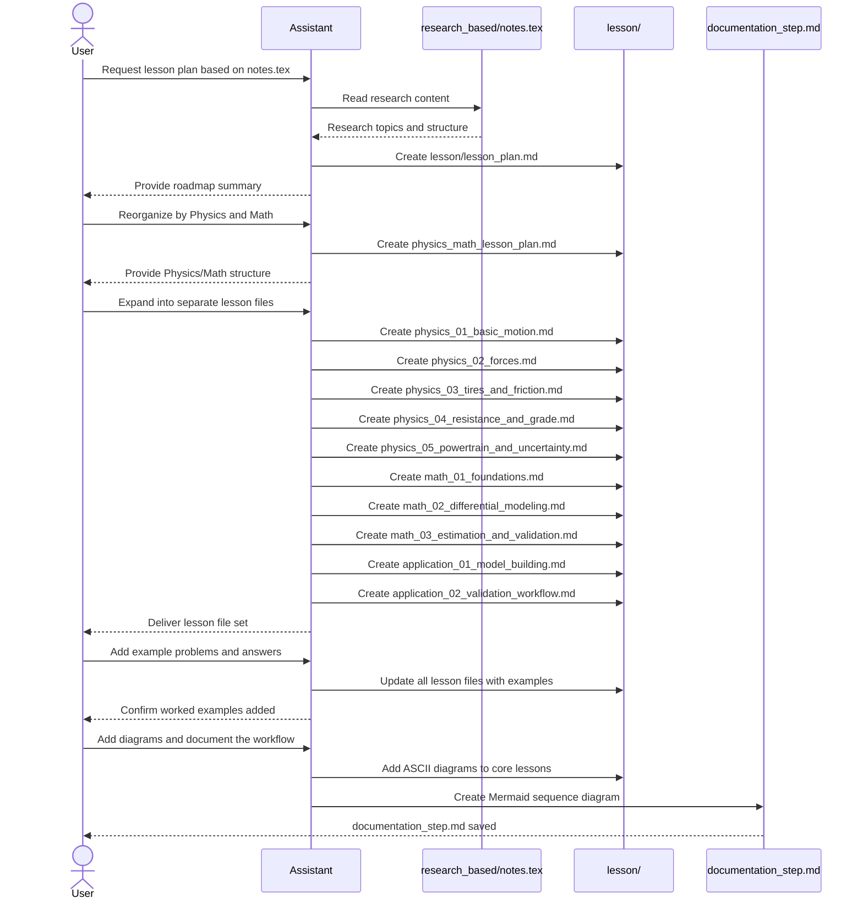

# Documentation Step

This file documents the lesson-material creation flow from the chat request to the generated output files.

## Mermaid Sequence Diagram

## Output Files Produced

- `lesson/lesson_plan.md`
- `lesson/physics_math_lesson_plan.md`
- `lesson/physics_01_basic_motion.md`
- `lesson/physics_02_forces.md`
- `lesson/physics_03_tires_and_friction.md`
- `lesson/physics_04_resistance_and_grade.md`
- `lesson/physics_05_powertrain_and_uncertainty.md`
- `lesson/math_01_foundations.md`
- `lesson/math_02_differential_modeling.md`
- `lesson/math_03_estimation_and_validation.md`
- `lesson/application_01_model_building.md`
- `lesson/application_02_validation_workflow.md`
- `documentation_step.md`

## Summary

The workflow followed three stages:
1. Extract structure from `research_based/notes.tex`
2. Reorganize the material into Physics, Math, and Application lessons
3. Expand the lessons with examples and diagrams for teaching use
